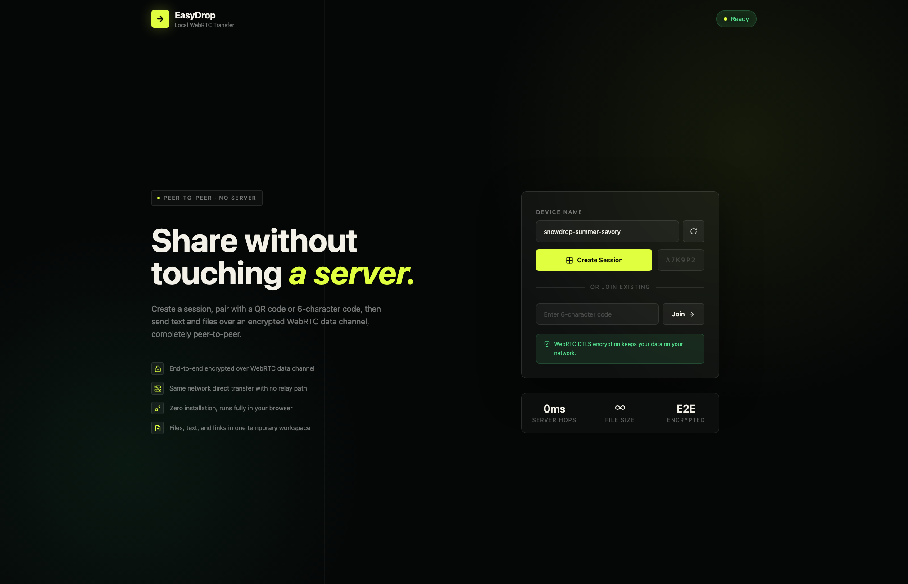

# EasyDrop

EasyDrop is a local-first peer-to-peer file and text sharing app. It lets two devices pair with a QR code or 6-character code, then transfer files, text, and links directly over a WebRTC data channel.

The server is used only for session creation and WebRTC signaling. Files are not uploaded to the server.



## Features

- QR code pairing
- 6-character connection code pairing
- Generated device names
- Text and link transfer
- Single and multiple file transfer
- Drag-and-drop file picker
- Receiver confirmation before accepting files
- Optional auto-accept transfers setting
- Transfer progress and speed display
- Transfer cancel
- Session close and peer leave handling
- Redis-backed signaling sessions with in-memory fallback
- Docker setup for web, signaling server, and Redis

## How It Works

1. One device creates a session.
2. The other device joins with the QR code or connection code.
3. The signaling server exchanges WebRTC offers, answers, and ICE candidates.
4. The browser-to-browser WebRTC data channel opens.
5. Text and file chunks transfer directly between devices.

No file payloads are stored by the server.

## Tech Stack

- Next.js 15
- React
- TypeScript
- Tailwind CSS
- Fastify
- Socket.IO
- Redis
- WebRTC `RTCDataChannel`
- Docker
- Vercel for the web app

## Monorepo Structure

```text
apps/
  web/                Next.js frontend
  signaling-server/   Fastify + Socket.IO signaling server

packages/
  shared-types/       Shared Socket.IO and session types
  transfer/           Transfer protocol helpers
  webrtc/             WebRTC configuration
```

## Requirements

- Node.js 22+
- npm 10+
- Docker, optional for containerized local development
- Redis, optional locally because the signaling server can fall back to memory

## Local Development

Install dependencies:

```bash
npm install
```

Create a local environment file:

```bash
cp .env.example .env
```

Run the web app and signaling server:

```bash
npm run dev
```

Or run them separately:

```bash
npm run dev:web
npm run dev:server
```

Default local URLs:

- Web: `http://localhost:3000`
- Signaling server: `http://localhost:4000`
- Health check: `http://localhost:4000/health`

For testing from another device on your LAN, set the signaling URL to a reachable host/IP instead of `localhost`.

## Environment Variables

### Web

```text
NEXT_PUBLIC_SIGNALING_URL=http://localhost:4000
```

This must be the public URL of the signaling server from the browser's perspective.

### Signaling Server

```text
PORT=4000
CLIENT_ORIGIN=http://localhost:3000
REDIS_URL=redis://localhost:6379
```

`REDIS_URL` is optional. Without it, sessions are stored in memory and disappear on server restart.

## Scripts

```bash
npm run dev          # run all development servers
npm run dev:web      # run Next.js only
npm run dev:server   # run signaling server only
npm run lint         # lint workspaces
npm run typecheck    # typecheck workspaces
npm run build        # build all workspaces
npm run build:web    # build web app only
npm run build:server # build signaling server only
```

## Docker

Run the full stack with Docker Compose:

```bash
npm run docker:up
```

Stop it:

```bash
npm run docker:down
```

The Compose stack includes:

- Next.js web app
- Signaling server
- Redis

For LAN testing:

```bash
NEXT_PUBLIC_SIGNALING_URL=http://192.168.1.10:4000 \
CLIENT_ORIGIN=http://192.168.1.10:3000 \
npm run docker:up
```

## Deployment

See [docs/deployment.md](docs/deployment.md) for full Docker and Vercel deployment instructions.

Production deployment is split into two parts:

- Deploy `apps/web` to Vercel from the `main` branch.
- Deploy `apps/signaling-server` to a long-running Node/WebSocket host.

Vercel is not suitable for the Socket.IO signaling server because it needs persistent WebSocket connections.

## Vercel Notes

Recommended Vercel settings:

- Production branch: `main`
- Root directory: `apps/web`
- Framework preset: Next.js
- Config: `apps/web/vercel.json`

Required Vercel environment variable:

```text
NEXT_PUBLIC_SIGNALING_URL=https://your-signaling-server.example.com
```

## Browser Support

EasyDrop targets modern browsers with WebRTC data channel support:

- Chrome
- Edge
- Firefox
- Android Chrome

## Security Model

- WebRTC data channels are encrypted with DTLS.
- File contents are not uploaded to the signaling server.
- Sessions are removed when no devices remain connected, or when a device explicitly closes the session.
- No accounts, passwords, or transfer history are stored.

## MVP Limitations

- No TURN server is included yet.
- Transfers are intended for local or directly reachable peer connections.
- Some restrictive networks may block direct WebRTC connections.
- Folder transfer is not implemented.
- No user accounts or trusted-device system.

## Contributing

Contributions are welcome.

Before opening a pull request:

```bash
npm run lint
npm run typecheck
npm run build
```

Keep changes focused and include notes about browser/device testing when the change touches WebRTC or transfers.

## License

No license has been selected yet. Add a `LICENSE` file before publishing the repository as open source.
